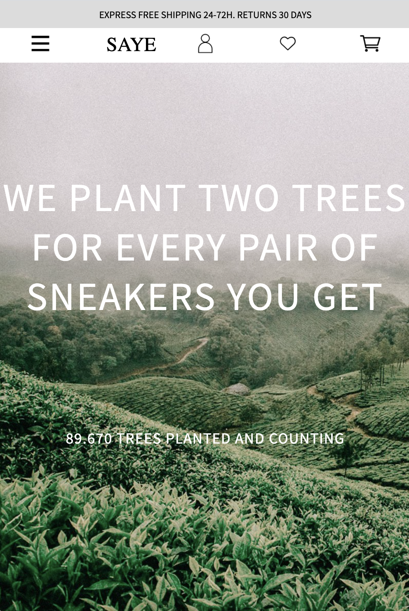
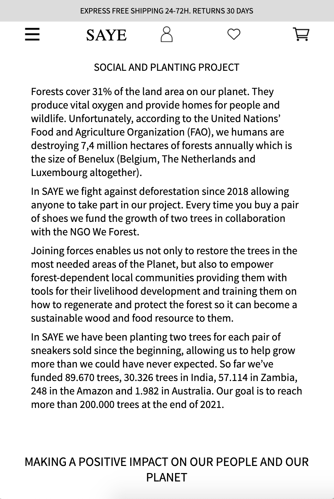
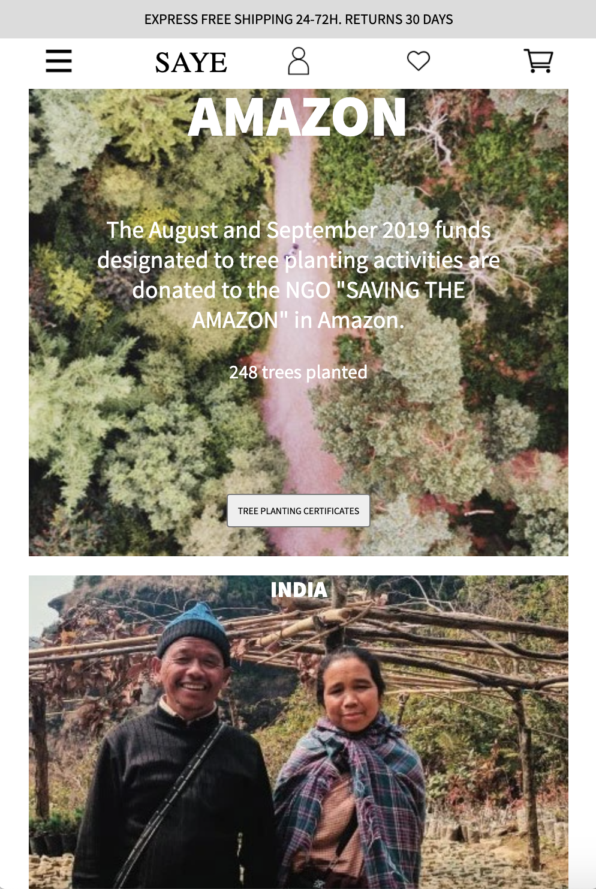
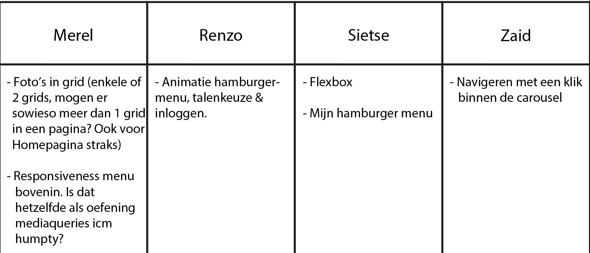

# Procesverslag
**Auteur:** Merel Thuis

Markdown cheat cheet: [Hulp bij het schrijven van Markdown](https://github.com/adam-p/markdown-here/wiki/Markdown-Cheatsheet). Nb. de standaardstructuur en de spartaanse opmaak zijn helemaal prima. Het gaat om de inhoud van je procesverslag. Besteedt de tijd voor pracht en praal aan je website.

## Bronnenlijst
1. https://www.sayebrand.com/
2. -...-
3. -...-

## Eindgesprek (week 7/8)

-dit ging goed & dit was lastig-

**Screenshot(s):**

-screenshot(s) van je eindresultaat-

## Voortgang 3 (week 6)

### Stand van zaken
- dit ging goed & dit was lastig -
Ik heb mijn header zo aangepast dat er 2 nav's zijn met het logo in het midden dmv order: -1 op de eerste nav. Ook heb ik het menu met CSS en Javascript van de zijkant laten komen. Wishlist en Shoppingcart moet nog. Ik ben verder gegaan met de footer, daar vond ik het moeilijk om de correcte ul's en li's aan te spreken. Ik krijg alleen de breedte van mn scherm niet gedebugged, dat is erg frustrerend. En de background-images van mijn socials zijn verdwenen en ik weet ook niet zo goed hoe ik die weer tevoorschijn kan toveren.

-screenshot(s) van hoe ver je bent-

### Agenda voor meeting 3

| Merel | Renzo | Sietse | Zaid |
| ----- | ----- | ------ | ---- |
| Zorgen dat body hele breedte van scherm in beslag neemt, debuggen | Inhoud van de main | Algemene netheid vragen |   |
| In footer de juiste ul en li aanspreken, welke selectors zijn daarvoor (erg veel ul's en li's) | Javascript, de ul's op elkaar afstemmen |   |   |
| Waarom zie je mn socials niet? |   |   |   |

### Verslag van meeting 3

## Voortgang 2 (week 5)

### Stand van zaken

-dit ging goed & dit was lastig-
Na de tips van vorige keer over de background-images en door de oefeningen waar dit ook nog eens in terug kwam ging het positioneren van de afbeeldingen als background-image een stuk beter. Ook ging het maken van de navigatiebalk ook best goed, de iconen links moeten wel nog even wat minder ruimte innemen ten opzichte van het logo, dus daar moet waarschijnlijk nog een flex-grow op. Ook wil ik nog een dropdown maken, maar dan dat ie vanuit links van het scherm komt. Ik vind het nog wel lastig om de teksten op de background images zo te plaatsen dat ze ook responsive zijn.

-screenshot(s) van hoe ver je bent-

### Agenda voor meeting 2

| Merel | Renzo | Sietse | Zaid |
| ----- | ----- | ------ | ---- |
| Foto's in grid (enkele of 2 grids, mogen er meerdere grids in een pagina? Ook voor homepage straks) | Animatie hamburgermenu, talenkeuze en inloggen | Flexbox | Navigeren met een klik binnen de carousel |
| Responsiveness menu bovenin. Is dat hetzelfde als oefening mediaqueries icm humpty? |  | Mijn hamburgermenu |   |
| Stylesheet voor meerdere pagina's als je geen classes gebruikt, hoe doe je dat slim? |  |  |  |

### Verslag van meeting 2
Niet vergeten om te controleren of het klopt met inspecteren. Je kunt daarbij vanuit verschillende devices bekijken hoe de code eruit ziet! 
Voor menu responsiveness inderdaad de mediaquery oefening gebruiken!
Foto's in eenkoloms grid plaatsen en met mediaquery veranderen in tweekoloms grid waarvan de eerste twee div's 1/-1 (dus verspreid over de twee kolommen).
Je kunt meerdere stylesheets gebruiken, maar probeer voor de 'algemene' dingen zoals de header en evt footer een algemene stylesheet te maken. Dan per pagina voor de details een andere.

## Voortgang 1 (week 3)

### Stand van zaken

-dit ging goed & dit was lastig-

Ik vond het moeilijk om de verschillende div's individueel vorm te geven. Ik vind het nog lastig om te bepalen welke 'container' je de position:relative moet geven.
Ook vind ik het nog lastig om afbeeldingen aan te passen. Dus dat je niet hun volledige grootte gebruikt als het scherm kleiner is, maar hij ook niet vervormd als ie groter of kleiner schaalt

-screenshot(s) van hoe ver je bent-

### Agenda voor meeting

Verschillende sections kaderen.
Afbeeldingen schalen en 'afsnijden' wanneer ze kleiner zijn

### Verslag van meeting

-na afloop snel uitkomsten vastleggen-
background-images gebruiken en spelen met position en size

## Intake (week 1)

**Je startniveau:** Rood/Blauw

**Je focus:** Responsive

**Je opdracht:** SAYE https://www.sayebrand.com/

**Screenshot(s):**

**Breakdown-schets(en):**

